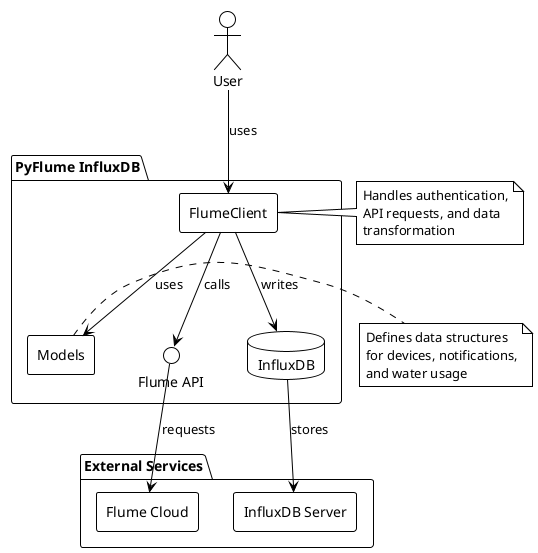
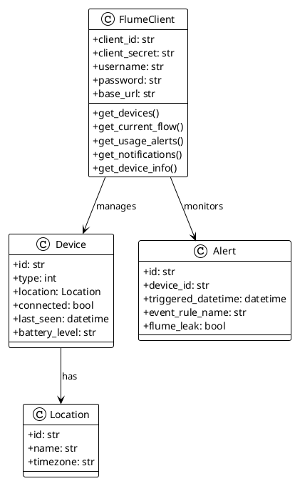
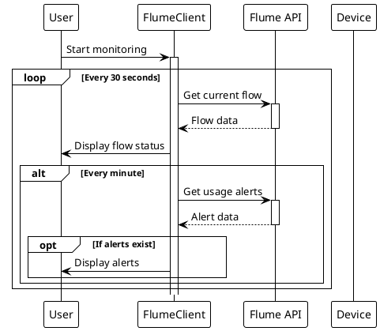
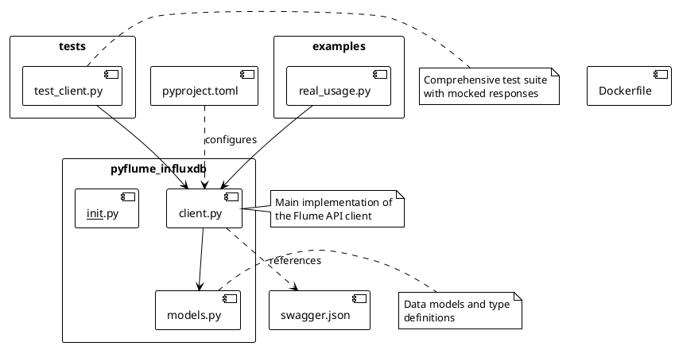
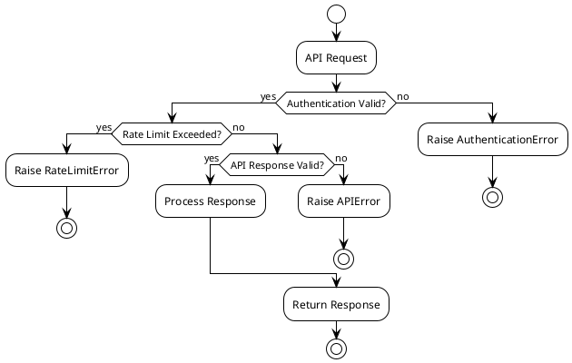

# PyFlume InfluxDB Integration

A Python library for integrating Flume Smart Water Monitor data with InfluxDB. This library provides a robust client for interacting with the Flume API and storing water usage data in InfluxDB for monitoring and analysis.

## Architecture



## Features

- **Authentication**: OAuth2 authentication with the Flume API
- **Device Management**: List and manage Flume devices
- **Real-time Monitoring**: Track water usage and flow rates
- **Alert Management**: Access and manage usage alerts and notifications
- **Data Storage**: Store water usage data in InfluxDB (optional)

## Component Overview

### Core Components



## Installation

```bash
pip install pyflume-influxdb
```

## Configuration

The library requires the following environment variables:

```bash
FLUME_CLIENT_ID=your_client_id
FLUME_CLIENT_SECRET=your_client_secret
FLUME_USERNAME=your_username
FLUME_PASSWORD=your_password
```

[Detailed Documentation](https://flumetech.readme.io/reference/accessing-the-api)

## Usage

### Basic Usage

```python
from pyflume_influxdb import FlumeClient

async with FlumeClient(
    client_id="your_client_id",
    client_secret="your_client_secret",
    username="your_username",
    password="your_password"
) as client:
    # Get all devices
    devices = await client.get_devices()
    
    # Get current flow for a device
    flow = await client.get_current_flow(device_id)
    
    # Get recent alerts
    alerts = await client.get_usage_alerts(device_id)
```

### Real-time Monitoring

The library includes a real-time monitoring example that demonstrates continuous water usage tracking:



## API Rate Limits

- The Flume API has a rate limit of 120 calls per hour
- The monitoring script respects this by:
  - Checking flow status every 30 seconds
  - Checking alerts every minute

## Development

### Project Structure



### Testing

The project includes a comprehensive test suite:

```bash
# Run tests in Docker
docker build -t pyflume-test .
docker run -it --rm -v $(pwd)/.env:/app/.env pyflume-test
```

## Error Handling

The client implements robust error handling for common scenarios:



## Contributing

1. Fork the repository
2. Create a feature branch
3. Make your changes
4. Run tests
5. Submit a pull request

## License

This project is licensed under the MIT License.

## Acknowledgments

- Flume API Documentation
- InfluxDB Python Client
- aiohttp Library 